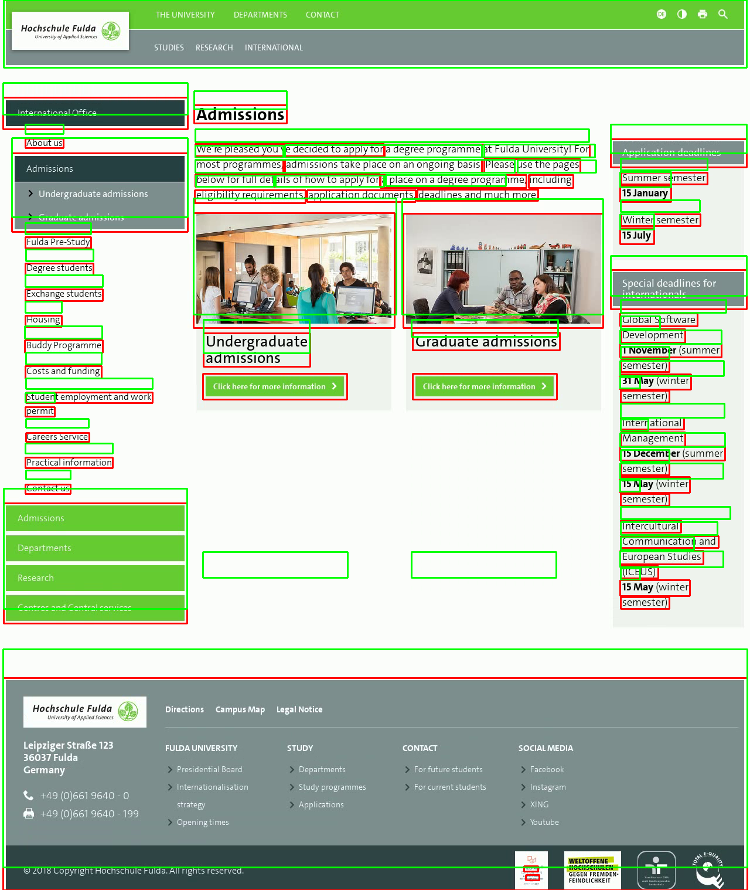

# Introduction
Python CLI tool to compare webapp frontend using Perceptual Image Hashing.

When you load same page in two different browser (e.g- Chrome and Firefox), you do not see any major visual dissimilarity. But there might be some minor visual differences that human eyes cannot identify. This tool helps finding those problems.

For example, below are the screenshots of a webpage in Chrome and Firefox:

Chrome             |  Firefox
:-------------------------:|:-------------------------:
  |  

You probably don't see much of a difference. But when analyzed with eyecatching, you can see some with markings.

Visual difference between Chrome and Firefox screenshot using one of the Perceptual Image Hashing method:

Positional differences of DOM elements in two separate browser (overlayed for brevity, Green boundaries belong to the reference image and red to comparable):

## Prerequisite
* Linux OS (tested in Ubuntu, should work in other distro)
* Firefox
* Chrome
* Node.js & NPM

## Installation and Setup

Only for first time:

`sudo pip install virtualenv` or `sudo easy_install virtualenv` or `sudo apt install python-virtualenv`

`git clone http://github.com/touhidrahman/eyecatching`

`cd eyecatching`

`virtualenv -p python3 venv`

`source venv/bin/activate`

`pip install --editable .`

`eyecatching firstrun` or `npm install`

## Run eyecatching

Activate virtual environment:

`cd eyecatching`

`. venv/bin/activate`

List of commands you can use:

`eyecatching --help`

You can see help for subcommands using:

`eyecatching [subcommand] --help`

You can use short `ec` instead of `eyecatching`:

`ec --help`

## Example:
Run comparison test using **linear** approach:

`eyecatching linear http://www.example.com`

Run comparison test using **recursive** approach:

`eyecatching recursive http://www.example.com`

Check shifts of objects inside images (alpha):

`eyecatching shift image1.png image2.png`

Compare two images without taking screenshot:

`eyecatching compare linear image1.png image2.png`

`eyecatching compare recursive image1.png image2.png`

Get screenshot for a URL (at present only chrome and firefox):

`eyecatching screenshot http://example.com`

Remove old input/output files:

`eyecatching reset`
